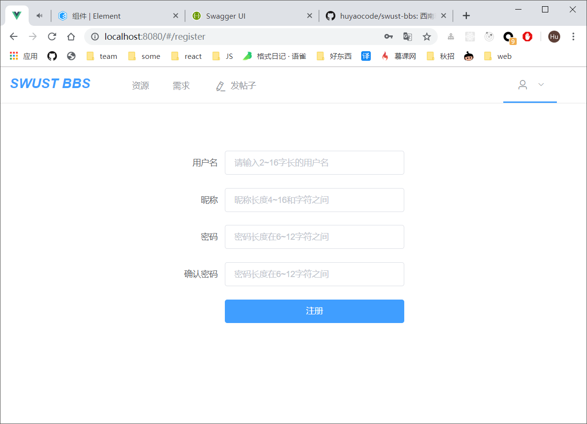
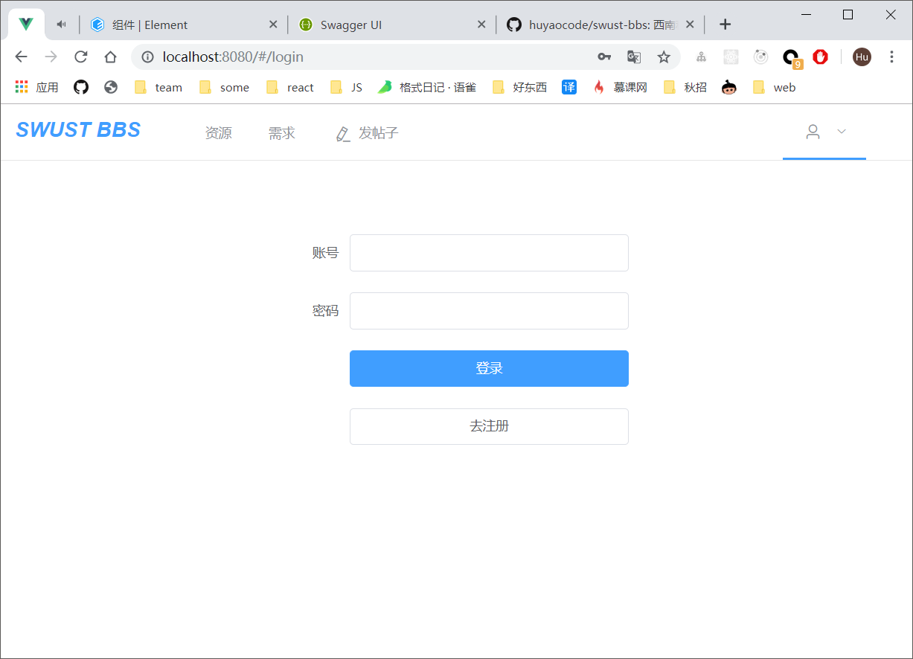
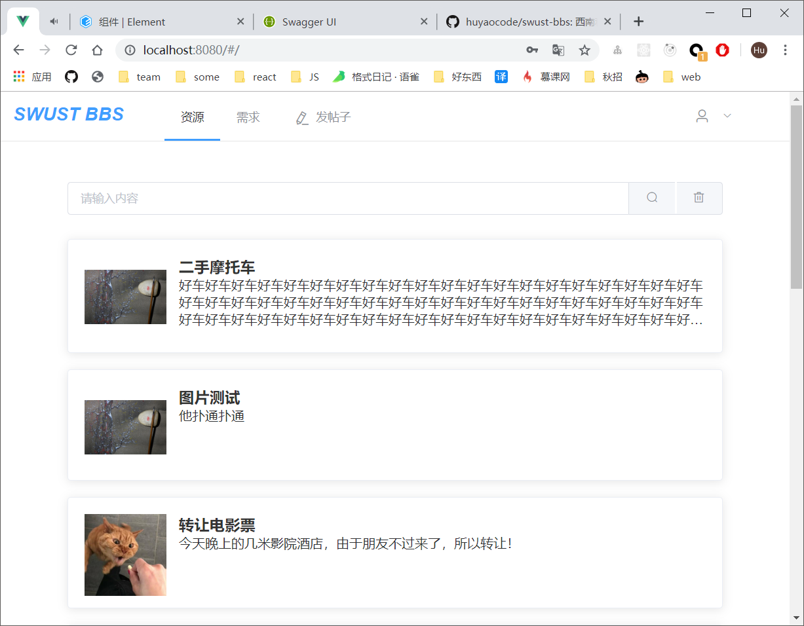
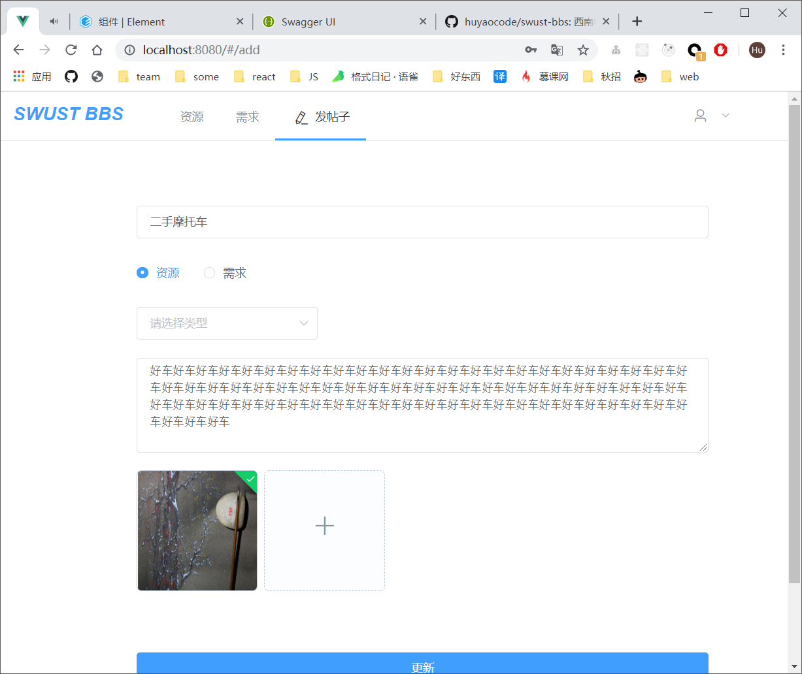
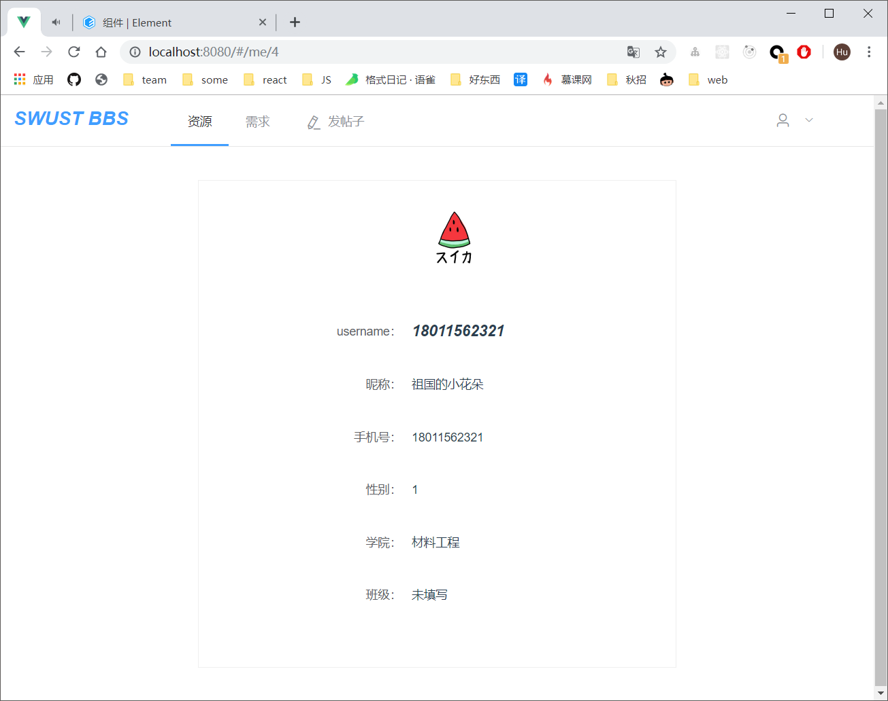

# swust-bbs
西南科技大学校园BBS

### 启动项目

下载项目 & 安装
```
git clone https://github.com/huyaocode/swust-bbs
cd swust-bbs/swust-bbs
npm install --registry https://registry.npm.taobao.org
npm run serve
```

### 项目描述
本项目是西南科技大学校园BBS，我们把BBS中信息分为两个大类：
 - 需求
   - 兼职
   - 寻物
   - ...
 - 资源
   - 失物招领
   - 跑腿
   - 闲置转让
   - ...

包含以下网页：
  - 注册与登录功能
  - 新建、更新、删除一个信息
  - 个人信息维护
  - 资源与需求的列表页
  - 个人收藏页

图片展示










